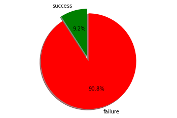
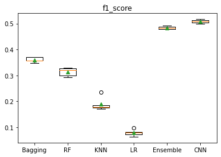

# Imbalanced-classification
In this repository, we consider Bank Marketing dataset, which is a public dataset available at https://archive.ics.uci.edu/ml/datasets/bank+marketing.
The data is related with a direct marketing campaign of a Portuguese banking institution.
The marketing campaign was based on phone calls. Often, more than one contact to the same client was required, 
in order to access if the product (bank term deposit) would be ('yes') or not ('no') subscribed.

## Data Dictionary

Let's, take a look at the dataset via the following data dictionary:

1 - age (numeric)

2 - job : type of job (categorical: "admin.","unknown","unemployed","management","housemaid","entrepreneur","student",
"blue-collar","self-employed","retired","technician","services")

3 - marital : marital status (categorical: "married","divorced","single";)

4 - education (categorical: "unknown","secondary","primary","tertiary")

5 - balance: average yearly balance, in euros (numeric)

6 - loan: has personal loan? (binary: "yes","no")

7 - campaign: number of contacts performed during this campaign and for this client (numeric, includes last contact)

**Output variable (desired target)**:
 y - has the client subscribed a term deposit? (binary: "yes","no").
 
## Classification: 
Based on the dataset, in this repository, we provide a classifier to increase the success rate of future marketing campaigns. 
Our classifier takes customers' personal information and then predicts the customers' answer, i.e. yes or no to future marketing campaigns.
The result of our classifier can help marketing business planners to focus on customers who are more willing to accept their offers. 

Based on the figure, only 9% of the customers said yes to the campaign. Therefore, the problem at hand is an imbalanced 
classification problem. We leverage machine learning classification algorithms to answer the above question.
Here, the outcome variable is the result of the marketing campaign, and predictor variables 
are the rest of the information included in the dataset. 

To this end, we leverage classification algorithms such as random forest decision trees, Bagging decision trees, 
cost-sensitive 1D convolutional neural networks, k-nearest neighbors method, and linear regression algorithm.

Moreover, since our task is an imbalanced classification problem, we try the ensemble learning technique. 

First, we build a pool of classifiers (pick the best classifiers among the above methods). 
Then, to make the dataset more balanced, under-sampling (Random Under sampling technique) and over-sampling (Synthetic Minority Oversampling Technique) 
methods are leveraged. In the next step, all classifiers that make at least one correct prediction are selected. 
The predictions from each classifier are then combined using a weighted average,
where the number of correct predictions in the neighborhood indicates the number of votes 
assigned to each classifier. Finally, based on the votes, the classification is performed.

## Result 
Based on the figure, we can observe that CNN and Ensemble learning algorithms achieve a higher F1 score compared to the other classifiers. 
The result suggests that our CNN could capture some complexity of data and extract meaningful features. 
However, since we ensemble bagging and random forest via the ensemble method, it could get a good result, 
which is comparable to a more complex method like the CNN approach.

